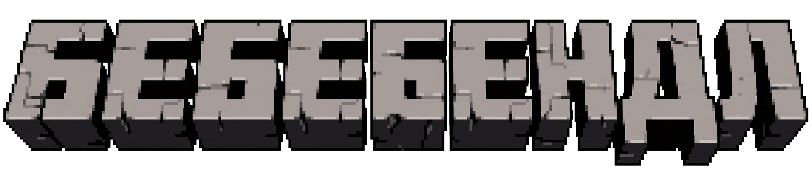

# Bebebendle

Scrandle по еде зрителей стримера Olesha. Каждый день — новый дейлик с 10 раундами.

## Что это?

Игра, в которой нужно угадать какое из двух блюд нравится больше зрителям. 10 раундов в день, можно играть только раз в сутки. После прохождения видишь свой результат и сравниваешь со средним по всем игрокам.

## Развертывание

Можно запускать двумя способами:
- Через Docker (рекомендуется для продакшена)
- Через PM2 без Docker (см. ниже)

```bash
# Скопировать и настроить переменные окружения
cp .env.sample .env
# Отредактировать .env (см. комментарии внутри .env.sample)

# Собрать и запустить
make up-build

# Применить миграции БД
make migrate
```

Приложение доступно на http://localhost:3000

## Запуск без Docker (PM2)

Можно запускать без Docker (полезно для разработки или когда БД поднята отдельно).

**Требования:**
- Bun + Node.js
- Python 3.11+ + [uv](https://docs.astral.sh/uv/)
- PostgreSQL и Redis (можно поднять только их через Docker)
- PM2: `npm install -g pm2`

**Подготовка:**

```bash
# 1. Настрой .env в корне проекта (см. .env.sample — там все актуальные переменные с комментариями)
cp .env.sample .env

# 2. Подготовь фронтенд
cd next
bun install
bun run build
cd ..

# 3. Подготовь бота
cd bot
uv sync
cd ..
```

**Важно про переменные окружения:**
- При запуске через PM2 .env из корня проекта может не подхватываться автоматически.
- Рекомендуется либо экспортировать переменные, либо скопировать .env в `next/` и `bot/`.

**Запуск:**

```bash
pm2 start ecosystem.config.js
pm2 logs
```

**Остановка:**

```bash
pm2 stop ecosystem.config.js
pm2 delete ecosystem.config.js
```

Приложение будет доступно на http://localhost:3000

> **Примечание:** При запуске без Docker директория с загрузками — `./uploads` в корне проекта.

## Makefile команды

| Команда | Описание |
|---------|----------|
| `make up-build` | Собрать и запустить все сервисы |
| `make down` | Остановить сервисы |
| `make logs` | Просмотр логов |
| `make migrate` | Применить миграции БД |
| `make new-daily` | Сгенерировать новый дейлик вручную |
| `make backfill-users` | Backfill `submitted_by_user_id` для существующих scrans (по telegram_id) |
| `make refresh-subscribers` | Обновить статус подписчика SVAGA+ для всех привязанных пользователей |
| `make pm2-start` | Запустить через PM2 (без Docker) |
| `make pm2-stop` | Остановить PM2 процессы |
| `make pm2-logs` | Логи PM2 |

### Data backfill & maintenance scripts

After the users/SVAGA+ linking migration, use these to maintain data consistency:

- `make backfill-users` — Matches legacy `scrans.telegram_id` to `users` and populates `submitted_by_user_id` for historical submissions. Idempotent and safe.
- `make refresh-subscribers` — Re-fetches current subscriber status from SVAGA+ for every linked user and updates the cached `is_subscriber` + timestamps. Useful as a periodic job (cron) or after bulk linking.

Both scripts run inside the `next` container using the shared DB. They can also be executed directly (with proper env) via `bun run scripts/<name>.ts` from `next/`.

## Как работает

1. Каждый день в 00:00 генерируется новый дейлик — 10 случайных пар блюд
2. Игрок выбирает одно из двух блюд в каждом раунде
3. Система считает процент голосов за каждое блюдо
4. Если выбрал блюдо с большим процентом — раунд засчитан
5. После 10 раундов показывается результат и сравнение со средним

## Структура

- `next/` — Next.js 16 + React 19 фронтенд
- `bot/` — Python aiogram бот
- `uploads/` — Загруженные изображения (динамически отдаются через /cdn/)
- PostgreSQL + Redis (через Docker или локально)

## Лицензия

MIT
